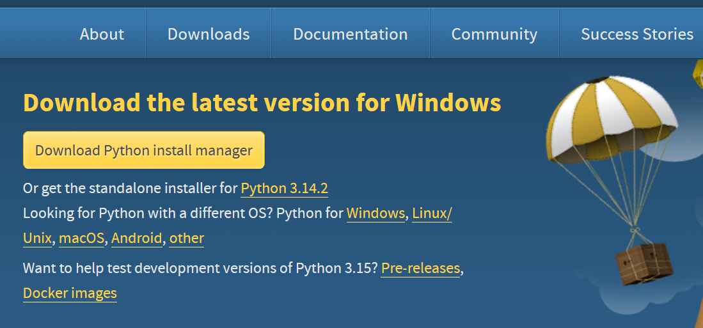
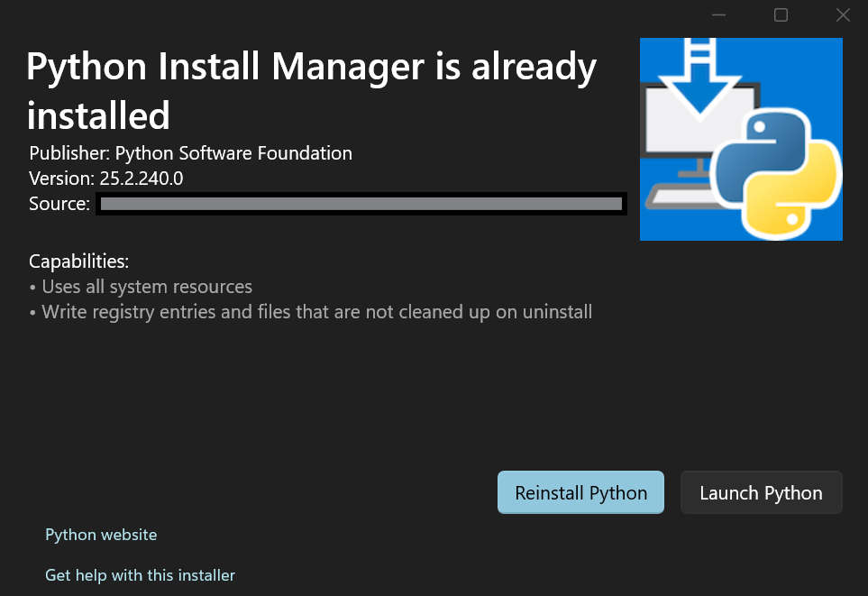
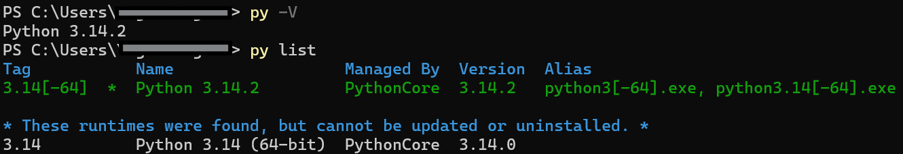

# Installing Python Install Manager

## How I installed it?

I wanted to upgrade Python to the latest version to get rid of a vulnerability alert for the Python version that I have
in my PC. So, I did what I normally do, google search "Python download". But unlike my previous attempts to download
Python from the "python.org" site, this time it asks me to download "Python Install Manager". So this blog-post is
about my experience installing that.

I downloaded the package manager this way and I opened it. I get this window.

I'm simply re-visiting my experience here. After this step, I saw a warning about application extention "py" is
associated with something else and it needs to be pointed to this new application (Python Install Manager). Once I did
that, I got this new shiny CLI way to check the python version that I'm running and upgrade, easy-peasy.

## Why this is better than installing standalone Python version?

## Tips and Tricks