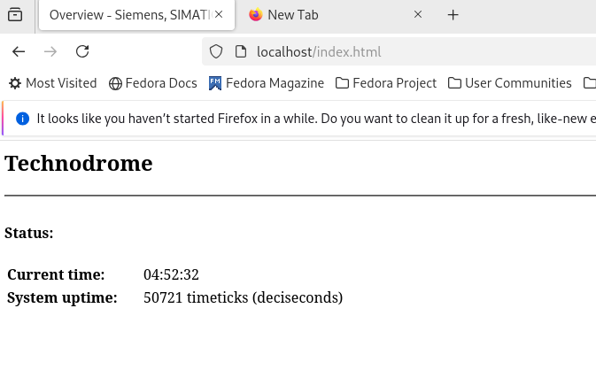
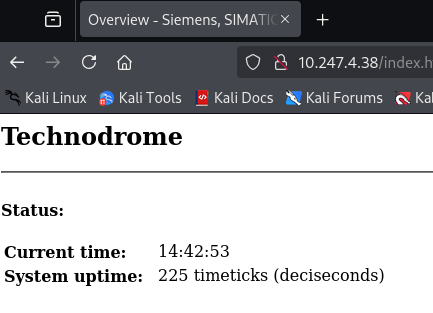

## Why?

I need to simulate a simple network with Kali-linux in one side and a VM that emulates an OT environment in other side.
In middle, I'll have FortiGate that connect these two networks (PCs). On the OT side, I don't have any OT gear, so need
something to emulate --> Conpot.

FortiGate has ATP license-set. My plan is to enable device-detection, OT IPS/AppCtrl signatures to detect traffic and
prevent intrusions. Let's see how it goes

## Installing Conpot --> Working with Fedora

I never worked with Fedora before so I thought of using it to simulate Conpot.
VM spin-up without DNS so I used the following method to fix it.

```text
sudo nano /etc/systemd/resolved.conf

[Resolve]
DNS=8.8.8.8 8.8.4.4
```

Then I restart "systemd-resolved" --> `sudo systemctl restart systemd-resolved`

* Once internet got fixed, did a 'sudo dnf upgrade' to upgrade all the stuff I got there.

## Trying to install ConPot Python-Package

Now I'll install Conpot `pip install conpot`...
Ahh! crc16 failing. Looks like for conpot, I need an older Python version --> v3.5 or before.

## Trying to install an older version of Python - v3.5.10

* Getting the gzipped file of Python v3.5.10 --> `wget https://www.python.org/ftp/python/3.5.10/Python-3.5.10.tgz`
* Unzip it --> `tar -xf Python-3.5.10.tgz`
* Go inside that folder --> `cd Python-3.5.10`
* Run installation

```text
./configure --enable-optimizations --prefix=/opt/python3.5
make -j$(nproc)
```

* Verify installation --> `/opt/python3.5/bin/python3.5 --version`
* OK. I have Python v3.5.10. Need a virtual-environment --> `/opt/python3.5/bin/python3.5 -m venv venv`
* Now I'm trying again `pip install conpot` --> so many errors that points to pip and setuptools version. Installing
versions that can support Python v3.5.10.

```text
pip install pip==20.3.4
pip install setuptools==50.0.0
```

* Failing again. Giving me "Segmentation Failure" which breaks even a simple "pip list". Don't have an option other
than trying again. In doing so, I found an awesome feature in Linux history. you can recall a command that you enter
before by specifying the line-number prefixed with "!". Simply like !100. History gets deleted at restart.

```text
!108 --means--> deactivate
!109 --means--> rm -rf venv
!111 --means--> /opt/python3.5/bin/python3.5 -m venv venv
!112 --means--> source venv/bin/activate
!165 --means--> pip install pip==20.3.4
!163 --means--> pip install setuptools==50.0.0
```

* ahhhh.... getting too many errors now. First time I got an error with "pycrypto" and then with "scapy".
Errors are throwing me off. Thinking of using a Docker.

## Trying to install ConPot Docker image

* Followed [this article](https://docs.docker.com/engine/install/fedora/) to install "Docker"
* Then I followed these steps to run Conpot. See [this article](https://conpot.readthedocs.io/en/latest/installation/
quick_install.html).

```text
docker pull honeynet/conpot
Run docker run -it -p 80:80 -p 102:102 -p 502:502 -p 161:161/udp --network=bridge honeynet/conpot:latest /bin/sh
conpot -f --template default
```

After this, when I navigate to "http://localhost". I got this!!!



## Testing with Kali

Kali and this Fedora machine both connects to FortiGate and there, it's super-open. I have any-any policy. So, I tried
Fedora machines IP and boom, I can access the page too..



!!! note
    Now I need a test plan.. That'll be a separate post!