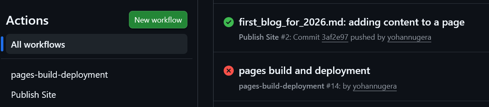
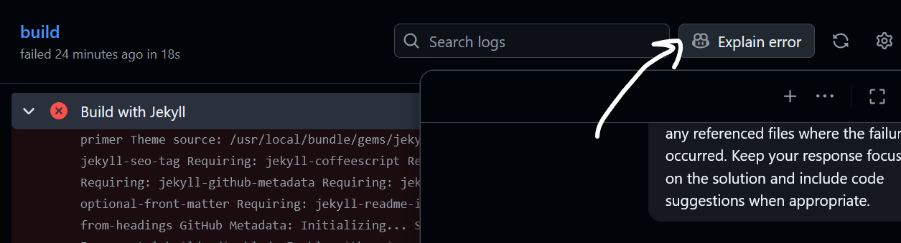

# First Blog for 2026

I want to make a habit of writing/publishing everything that I do technically here so that I can keep a track of what
I'm doing and to improve my writing skills. So, as my first job, I wanted to simplify my blogging experience with a
github actions process to automatically upload what I'm writing to my GitHub static-hosted site.

This is the script of workflow I'm gonna use:

```text
name: Documentation
on:
  push:
    branches:
      - master
      - main
permissions:
  contents: read
  pages: write
  id-token: write
jobs:
  deploy:
    environment:
      name: github-pages
      url: ${{ steps.deployment.outputs.page_url }}
    runs-on: ubuntu-latest
    steps:
      - uses: actions/configure-pages@v5
      - uses: actions/checkout@v5
      - uses: actions/setup-python@v5
        with:
          python-version: 3.x
      - run: pip install -r requirements.txt
      - run: mkdocs build --clean
      - uses: actions/upload-pages-artifact@v4
        with:
          path: site
      - uses: actions/deploy-pages@v4
        id: deployment
```

Let's see if it works! I'm going to push this article now and see if it'll generate the site for me as soon as I 
commit-and-push it to GitHub.

I can see that my workflow is generating two GitHub Actions (workflows).



I acknowledge "Publish Site" one, because I created it but "pages-build-deployment" is something spawn up automatically.

!!! note "Fixing the Error"
    

    I used "Explain Error" AI option in Github :)
    It appears that the date-time format I used in my files are not rendering properly to html.

## What is "pages-build-deployment" workflow?

I guess the way GitHub highlight them when kinda explains it.


It says "push" on "Publish Site ..." workflow and "dynamic" on "pages build on deployment" workflow. So, it appears that
"actions/upload-pages-artifact@v4" and "actions/deploy-pages@v4" is doing this magic.

Cool!!! from now on, I only need to write pages as usual and I don't have to maintain it conciously.