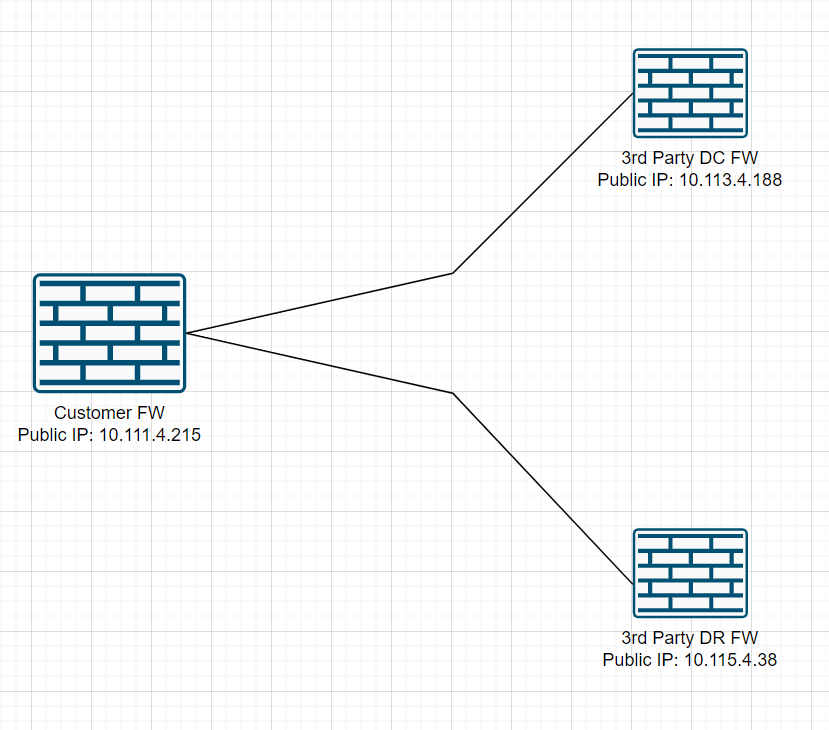
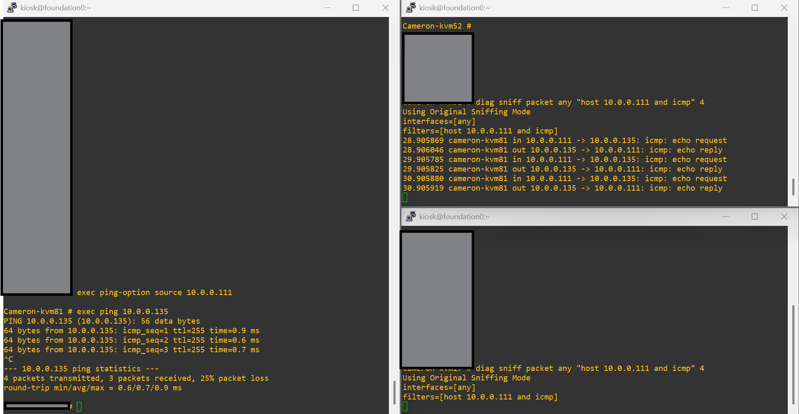
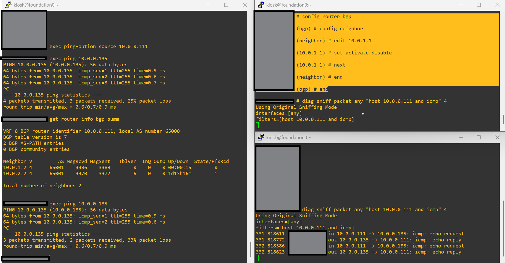

## Requirement

My customer wanted to configure two VPNs with a 3rd party, one with their primary site and another with their DR. They
wanted to use BGP to advertise their subnet to us dynamically, so that we don't have to configure multiple static
routes (with different admin-distances), plus, static-routing makes the setup a bit rigid.

## Testing

### Initial Configuration - VPN Creation

I will configure three FortiGates, one will be my customer's FW and other 2 will be our 3rd party devices. 



So I have this 3 FWs (actually, to facilitate routing between these FWs, I have another FW in middle, so 4) and I have
configured 3 IPs on their public-facing interface. With routing established, I'll move on and configure the VPNs.

On Customer FW, I have configured two VPNs and policies to match traffic.

```console title="Customer FW Config"
Customer-FW # show system interface
...
    edit "lo0"
        set vdom "root"
        set ip 10.0.0.111 255.255.255.255
        set allowaccess ping https
        set type loopback
        set snmp-index 16
    next
...

Customer-FW # show router static
config router static
    edit 2
        set dst 10.113.4.188 255.255.255.255
        set gateway 10.111.1.119
        set device "port2"
        set comment "3rd-party_DC"
    next
    edit 3
        set dst 10.115.4.38 255.255.255.255
        set gateway 10.111.1.119
        set device "port2"
        set comment "3rd-party_DR"
    next
end

Customer-FW # show vpn ipsec phase1-interface
config vpn ipsec phase1-interface
    edit "3rd-party_DC"
        set interface "port2"
        set ike-version 2
        set peertype any
        set net-device disable
        set proposal aes256gcm-prfsha256
        set dhgrp 14
        set transport auto
        set remote-gw 10.113.4.188
        set psksecret ENC TQPcWY1vtrq6hP+9FLK8rGdWcaIdyVv1WCcI3hgjxty3jrvcstHZ9LZOHGcS5UhaTPYtwXbC/X/F7djUBFUyGGPyEmCpVSmL+SBHurrIAqiuLRvKTf5srtlSd8yZLC1EWyaUbVnQlU/kp6bQ0GfxaG1+4mUybDCAfXNw1FPBkOSeLiscu3RsWPOmVHzzebHrpSPGDVlmMjY3dkVA
    next
    edit "3rd-party_DR"
        set interface "port2"
        set ike-version 2
        set peertype any
        set net-device disable
        set proposal aes256gcm-prfsha256
        set dhgrp 14
        set transport auto
        set remote-gw 10.115.4.38
        set psksecret ENC uOZmdKo/GXSuB6Hyo+BKjps10M/SyZADArOLiGa48YvuU1WOjqEuCTrpZw4iqQtL165s7+AI0dprry/AtSCHkmCHtxjnj4C0jqu7iwt2JyDt46gItmnJt4WtBVCr9uUXBc8b/g2AFOE9NODZABRNaLjHhGlra3Hr1MekbwZ8c9AdIk59cMEsoaY0tyNHRamupkmKnllmMjY3dkVA
    next
end

Customer-FW # show vpn ipsec phase2-interface
config vpn ipsec phase2-interface
    edit "DC_to_3rd-party_DC"
        set phase1name "3rd-party_DC"
        set proposal aes256gcm
        set dhgrp 14
        set src-subnet 10.0.0.111 255.255.255.255
        set dst-subnet 10.0.0.135 255.255.255.255
    next
    edit "DC_to_3rd-party_DR"
        set phase1name "3rd-party_DR"
        set proposal aes256gcm
        set dhgrp 14
        set src-subnet 10.0.0.111 255.255.255.255
        set dst-subnet 10.0.0.135 255.255.255.255
    next
    edit "DC_to_3rd-party_DC_tunnel"
        set phase1name "3rd-party_DC"
        set proposal aes256gcm
        set dhgrp 14
        set src-subnet 10.0.1.1 255.255.255.255
        set dst-subnet 10.0.1.2 255.255.255.255
    next
    edit "DC_to_3rd-party_DR_tunnel"
        set phase1name "3rd-party_DR"
        set proposal aes256gcm
        set dhgrp 14
        set src-subnet 10.0.2.1 255.255.255.255
        set dst-subnet 10.0.2.2 255.255.255.255
    next
end

Customer-FW # show firewall policy
config firewall policy
    edit 1
        set name "DC_to_3rd-party_DCnDR"
        set uuid ce830930-f681-51f0-3aca-4c5bf413f50f
        set srcintf "lo0"
        set dstintf "3rd-party_DC" "3rd-party_DR"
        set action accept
        set srcaddr "all"
        set dstaddr "all"
        set schedule "always"
        set service "ALL"
        set logtraffic all
        set capture-packet enable
        set auto-asic-offload disable
    next
    edit 2
        set name "3rd-party_DCnDR_to_DC"
        set uuid eb496726-f681-51f0-68ed-eb35baa21888
        set srcintf "3rd-party_DC" "3rd-party_DR"
        set dstintf "lo0"
        set action accept
        set srcaddr "all"
        set dstaddr "all"
        set schedule "always"
        set service "ALL"
        set logtraffic all
        set capture-packet enable
        set auto-asic-offload disable
    next
end
```

!!! note "Why lo0 loopback interface?"
    I don't have (actually I'm lazy) a client/server PCs connected to either my customer-FW side or 3rd Party DC/DR
    FWs. So, to simulate VPN traffic, I have it. Now, I know that when you initiate ping traffic (or telnet),
    it always takes the egress interface IP and even if you change source-IP to be this "lo0" IP, it won't match the
    policies I have in the firewall. My aim is not to match policies to begin with, and I know that remote-end FW will
    do policy matching for me.

For 3rd party DC, I configured its settings as follows.

```console title="3rd Party DC FW Config"
3rd_Party_DC # show system interface
...
    edit "lo0"
        set vdom "root"
        set ip 10.0.0.135 255.255.255.255
        set allowaccess ping https
        set type loopback
        set snmp-index 16
    next
...

3rd_Party_DC # show router static
config router static
    edit 2
        set dst 10.111.4.215 255.255.255.255
        set gateway 10.113.1.119
        set device "port2"
    next
end

3rd_Party_DC # show vpn ipsec phase1-interface
config vpn ipsec phase1-interface
    edit "Customer_FW"
        set interface "port2"
        set ike-version 2
        set peertype any
        set net-device disable
        set proposal aes256gcm-prfsha256
        set dhgrp 14
        set transport auto
        set remote-gw 10.111.4.215
        set psksecret ENC 9XD3+0NBaciLsVVJYXRnyK1xkvjTd2G0rbsPUcWPQXiGSEJ7KepUMvy9/YyKWP6R0sUp5vbbFgnMOsyAVRJFQMg491YGjkusHI39v78uEbmMcrSSbgWlookBCBmUyG5hpKo+hC97NGvqWZaGtUY7vX/LDSVUlF1TS+6OMZSJnJhGGd8JZVI/Q+ZXrNbP58yWYaRTvFlmMjY3dkVA
    next
end

3rd_Party_DC # show vpn ipsec phase2-interface
config vpn ipsec phase2-interface
    edit "DC_to_Customer_FW"
        set phase1name "Customer_FW"
        set proposal aes256gcm
        set dhgrp 14
        set src-subnet 10.0.0.135 255.255.255.255
        set dst-subnet 10.0.0.111 255.255.255.255
    next
    edit "DC_to_Customer_FW_tunnel"
        set phase1name "Customer_FW"
        set proposal aes256gcm
        set dhgrp 14
        set src-subnet 10.0.1.2 255.255.255.255
        set dst-subnet 10.0.1.1 255.255.255.255
    next
end

3rd_Party_DC # show firewall policy
config firewall policy
    edit 1
        set name "DC_to_Customer_FW"
        set uuid 7bea9dd2-f681-51f0-dd28-bfa05d853f1d
        set srcintf "lo0"
        set dstintf "Customer_FW"
        set action accept
        set srcaddr "all"
        set dstaddr "all"
        set schedule "always"
        set service "ALL"
        set logtraffic all
        set capture-packet enable
        set auto-asic-offload disable
    next
    edit 2
        set name "Customer_FW_to_DC"
        set uuid ab57921e-f681-51f0-da88-d0523267c2ef
        set srcintf "Customer_FW"
        set dstintf "lo0"
        set action accept
        set srcaddr "all"
        set dstaddr "all"
        set schedule "always"
        set service "ALL"
        set logtraffic all
        set capture-packet enable
        set auto-asic-offload disable
    next
end
```

Similarly, I have almost same configuration on 3rd Party DR FW and now I have two active VPN connections to my
Customer FW. I purposefully disabled "add-route" option under phase1-interface because I don't want FortiOS to add a
route automatically to the VPN I'm creating here as my plan is to run BGP through it.

So, now the fun part, running BGP.

### Configuring BGP

At first, tunnel interfaces that got created automatically looks like this.

```console title="Customer-FW BGP configuration"
Customer-FW # show router prefix-list
config router prefix-list
    edit "prefix_list_out"
        config rule
            edit 1
                set prefix 10.0.0.111 255.255.255.255
                unset ge
                unset le
            next
            edit 2
                set action deny
                set prefix any
                unset ge
                unset le
            next
        end
    next
    edit "prefix_list_in"
        config rule
            edit 1
                set prefix 10.0.0.135 255.255.255.255
                unset ge
                unset le
            next
            edit 2
                set action deny
                set prefix any
                unset ge
                unset le
            next
        end
    next
end

Customer-FW # show router route-map
config router route-map
    edit "3rd_Party_DC_route-map_out"
        config rule
            edit 1
                set match-ip-address "prefix_list_out"
                unset set-ip-prefsrc
            next
        end
    next
    edit "3rd_Party_DC_route-map_out"
        config rule
            edit 1
                set match-ip-address "prefix_list_out"
                unset set-ip-prefsrc
            next
        end
    next
    edit "3rd_Party_DR_route-map_in"
        config rule
            edit 1
                set match-ip-address "prefix_list_in"
                unset set-ip-prefsrc
            next
        end
    next
    edit "3rd_Party_DC_route-map_in"
        config rule
            edit 1
                set match-ip-address "prefix_list_in"
                unset set-ip-prefsrc
                set set-local-preference 500
            next
        end
    next
end

Customer-FW # show router bgp
config router bgp
    set as 65000
    config neighbor
        edit "10.0.1.2"
            set soft-reconfiguration enable
            set remote-as 65001
            set route-map-in "3rd_Party_DC_route-map_in"
            set route-map-out "3rd_Party_DC_route-map_out"
        next
        edit "10.0.2.2"
            set soft-reconfiguration enable
            set remote-as 65001
            set route-map-in "3rd_Party_DR_route-map_in"
            set route-map-out "3rd_Party_DR_route-map_out"
        next
    end
    config redistribute "connected"
        set status enable
    end
end
```

So, from the route-map, I increased the local-preference from the routes I learn from 3rd Party DC because I want to
prefer that path when things are all going pretty well. 

### Validation

I checked the routing-table and it showed me this.

```console
Customer-FW # get router info routing-table detail
Codes: K - kernel, C - connected, S - static, R - RIP, B - BGP
       O - OSPF, IA - OSPF inter area
       N1 - OSPF NSSA external type 1, N2 - OSPF NSSA external type 2
       E1 - OSPF external type 1, E2 - OSPF external type 2
       i - IS-IS, L1 - IS-IS level-1, L2 - IS-IS level-2, ia - IS-IS inter area
       V - BGP VPNv4
       * - candidate default

Routing table for VRF=0
...
B       10.0.0.135/32 [20/0] via 10.0.1.2 (recursive via cameron-kvm52 tunnel 10.113.4.188), 1d13h14m, [1/0]
...
```

To check if both parties are sending me the subnet that I'm trying to reach, I check the routes they advertised.

```console
Customer-FW # get router info bgp summ

VRF 0 BGP router identifier 10.0.0.111, local AS number 65000
BGP table version is 6
2 BGP AS-PATH entries
0 BGP community entries

Neighbor V         AS MsgRcvd MsgSent   TblVer  InQ OutQ Up/Down  State/PfxRcd
10.0.1.2 4      65001    3369    3371        6    0    0 1d13h15m        1
10.0.2.2 4      65001    3354    3358        6    0    0 1d13h03m        1

Total number of neighbors 2
```

OK, what are they sending?

```console
Customer-FW # get router info bgp neighbor 10.0.1.2 received-routes
VRF 0 BGP table version is 6, local router ID is 10.0.0.111
Status codes: s suppressed, d damped, h history, * valid, > best, i - internal
Origin codes: i - IGP, e - EGP, ? - incomplete

   Network          Next Hop            Metric     LocPrf Weight RouteTag Path
*> 10.0.0.135/32    10.0.1.2                               0        0 65001 ? <-/->
*> 10.0.1.2/32      10.0.1.2                               0        0 65001 ? <-/->
*> 10.47.0.0/20     10.0.1.2                               0        0 65001 ? <-/->
*> 10.113.0.0/20    10.0.1.2                               0        0 65001 ? <-/->

Total number of prefixes 4


Customer-FW # get router info bgp neighbor 10.0.2.2 received-routes
VRF 0 BGP table version is 6, local router ID is 10.0.0.111
Status codes: s suppressed, d damped, h history, * valid, > best, i - internal
Origin codes: i - IGP, e - EGP, ? - incomplete

   Network          Next Hop            Metric     LocPrf Weight RouteTag Path
*> 10.0.0.135/32    10.0.2.2                               0        0 65001 ? <-/->
*> 10.0.2.2/32      10.0.2.2                               0        0 65001 ? <-/->
*> 10.47.0.0/20     10.0.2.2                               0        0 65001 ? <-/->
*> 10.115.0.0/20    10.0.2.2                               0        0 65001 ? <-/->

Total number of prefixes 4
```

See, they can (actually I am) send a lot of subnet but we only have one subnet in our routing-table. Why? because of
the route-map we have in place towards inward direction. We just filter-out what we really want.

### Testing with traffic

Normal case, my PING traffic goes to 3rd Party DC.



RHS-top console windows is 3rd Party DC. So, it works, nice :)

Now I'll stop advertising "10.0.0.135/32" from 3rd party DC by deactivating its BGP neighbor.

```console title="disable BGP neighbor from 3rd Party DC"
config router bgp
    config neighbor
        edit 10.0.1.1
            set activate disable
        next
    end
end
```



That works too, nice :)

